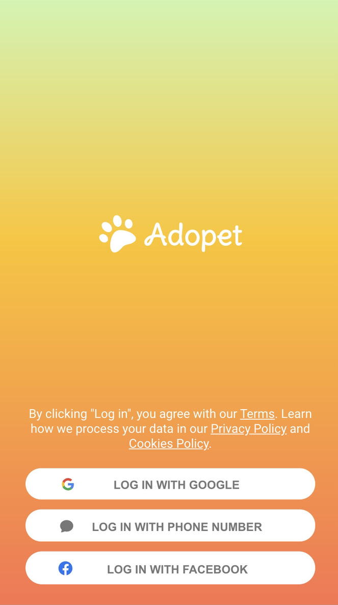
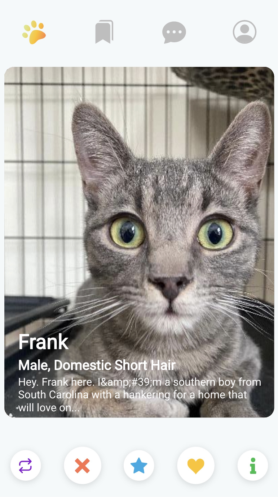
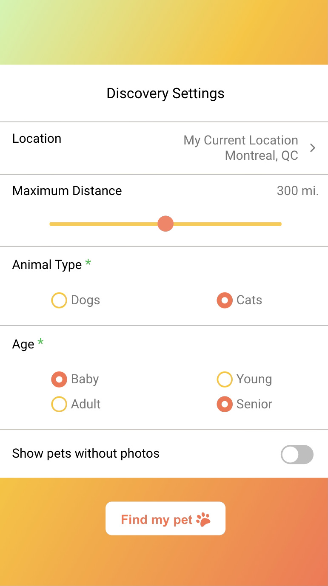
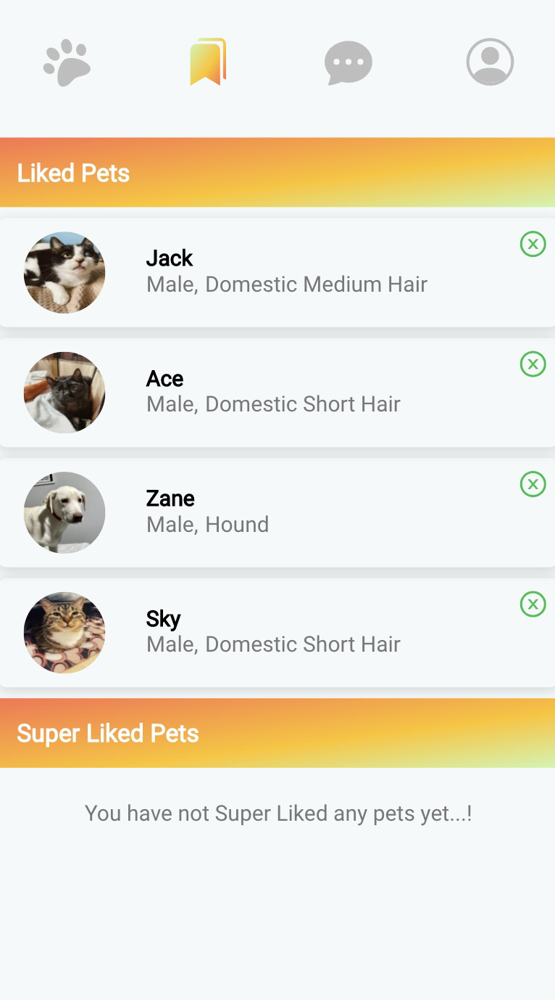

# Adopet - Pet Adoption App (Concordia Bootcamps Final Project)

## Introduction

**Adopet** is a full-stack application that was created using React.js, Node.js, and Firebase database. It is a Tinder clone for adopting rescue animals. Users can log in, filter animals based on their location and preferences, and swipe left, right, and top to find their new furry best friends!

## APIs

- [PetFinder API](www.petfinder.com)
- [Google Maps JavaScript API](https://developers.google.com/maps)
- [OpenCage Data API](https://opencagedata.com/api)
- [Abstract IP Geolocation API](https://www.abstractapi.com/ip-geolocation-api)
- [Stripe API](https://stripe.com/docs/api)

## Database and Authentication

- [Firebase](https://firebase.google.com/)

## Features

- Ability to log in with Firebase authentication (Gmail, Facebook, and phone number)
- Ability to filter and view animals based on user location and various search criteria (i.e., distance, animal types, age, and photos)
- Ability to view a detailed profile of an animal
- Ability to swipe on animals (Like, Dislike, SuperLike)
- Ability to bookmark Liked/SuperLiked animals
- Ability to view information on rescue organizations and contact them
- Ability to submit an adoption application and make a deposit using Stripe API

### Future Improvements

- Make the app responsive for tablet and desktop devices. 
  This is a mobile (first) app. It is currently only compatible with mobile screen sizes.

## Netlify Link

https://adopet-pet-adoption.netlify.app

## Images

